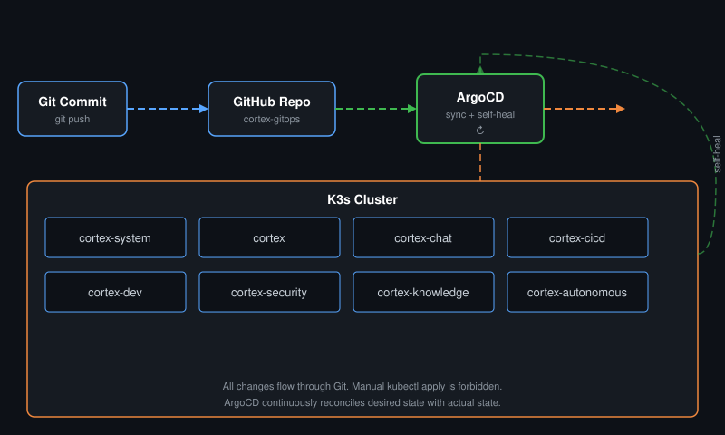

<div align="center">

# Cortex GitOps

**The source of truth for all Cortex K3s deployments.**

> :warning: **This project is archived.** No longer under active development.

</div>

---

## How It Works

ArgoCD watches this repo and syncs changes to the K3s cluster automatically. Manual `kubectl apply` is forbidden — all changes flow through Git.

## Architecture

<div align="center"></div>

## Structure

```
cortex-gitops/
├── apps/                      # Manifests by namespace
│   ├── cortex-system/        # Core platform services
│   ├── cortex/               # Main services
│   ├── cortex-chat/          # Chat interface
│   ├── cortex-cicd/          # CI/CD pipelines
│   ├── cortex-dev/           # Dev tools
│   ├── cortex-security/      # Security (Wazuh, scanning)
│   ├── cortex-knowledge/     # Knowledge management
│   └── cortex-autonomous/    # Autonomous agents
├── argocd-apps/              # ArgoCD Application CRDs
└── base/                     # Base kustomizations
```

## Rules

1. All cluster resources **must** be defined here
2. ArgoCD self-heals — manual changes are reverted
3. Git history = audit trail

---

<div align="center">
<sub>Built with Claude. No longer maintained.</sub>
</div>
