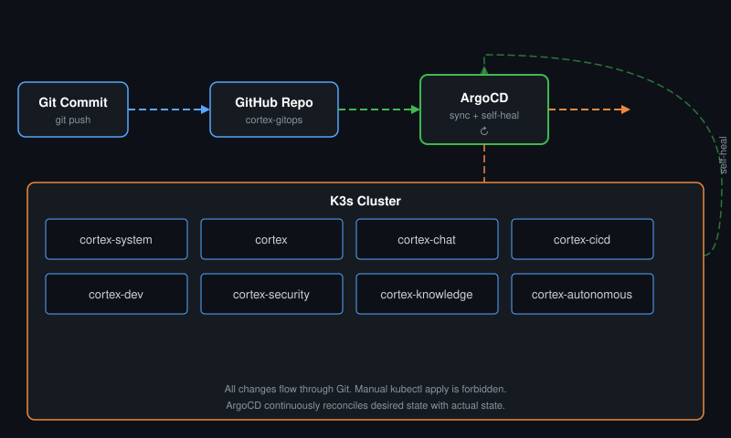

> [!NOTE]
> **Archived.** This repo is part of [Cortex](https://github.com/cortex-io), which is no longer under active development. It is kept as a working record: explore, fork and borrow freely, but no fixes or features are planned.

<p align="center"><sub><a href="https://github.com/cortex-io"><b>Cortex</b></a> &nbsp;·&nbsp; <a href="https://github.com/cortex-io/cortex">cortex</a> · <a href="https://github.com/cortex-io/cortex-platform">cortex-platform</a> · <b>cortex-gitops</b> · <a href="https://github.com/cortex-io/cortex-k3s">cortex-k3s</a> · <a href="https://github.com/cortex-io/cortex-docs">cortex-docs</a> · <a href="https://github.com/cortex-io/cortex-construction-hq">cortex-construction-hq</a> · <a href="https://github.com/cortex-io/infrastructure-docs">infrastructure-docs</a></sub></p>

## How it works

ArgoCD watched this repo and synced every change to the K3s cluster. Manual `kubectl apply` was forbidden: all changes flowed through Git, and ArgoCD reverted anything that drifted.



## Layout

```
cortex-gitops/
├── apps/                 # manifests by namespace
│   ├── cortex/  cortex-system/  cortex-csaf/
│   ├── fabric-chat/  fabric-gateway/  fabric-k8s/  fabric-pipelines/
│   ├── monitoring-ingress/  sandfly/  tailscale/
│   └── default/
├── argocd-apps/          # ArgoCD Application CRDs
├── csaf/                 # CSAF advisory service: correlator, registry, scheduler, Postgres
├── infra/                # K3s infrastructure
├── scripts/
└── docs/
```

See [MANUAL_STEPS_REQUIRED.md](MANUAL_STEPS_REQUIRED.md) for the few things that couldn't live in Git.

## The rules

1. Every cluster resource **must** be defined here.
2. ArgoCD self-heals: manual changes are reverted.
3. Git history is the audit trail.

---

<p align="center"><sub>Part of the <a href="https://github.com/cortex-io">Cortex archive</a> · built with Claude</sub></p>
